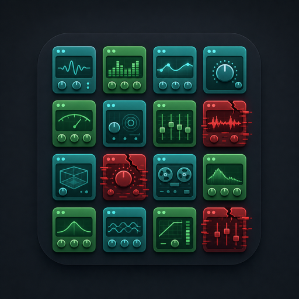

# Pedalboard Pluginary

{: width="200" }

Find every VST3 and Audio Unit plugin on your machine, read its parameters, and query the lot from Python or the shell. Each plugin is scanned in its own subprocess, so the one plugin that segfaults on load can't take the whole scan down with it.

Pedalboard Pluginary is a companion to Spotify's [Pedalboard](https://github.com/spotify/pedalboard) library, which it uses to introspect plugins. It is not affiliated with Spotify.

## Install

```bash
pip install pedalboard-pluginary
```

## Three commands

```bash
pbpluginary scan          # discover and catalogue your plugins
pbpluginary list          # show them in a table
pbpluginary info          # counts, top vendors, cache location
```

The first scan can take a while; results are cached in a local SQLite database, so every command after that is instant. If a scan is interrupted, the next `scan` resumes where it stopped.

## Where to next

- [CLI reference](cli.md) — every command and flag.
- [Architecture](architecture.md) — process isolation, journaling, and the SQLite cache.

## Platform support

| Format | macOS | Windows | Linux |
|--------|:-----:|:-------:|:-----:|
| VST3   | yes   | yes     | yes   |
| AU (aufx) | yes | —      | —     |

Audio Units exist only on macOS, so AU scanning runs there alone (via `auval`). VST3 discovery works everywhere Pedalboard runs.
